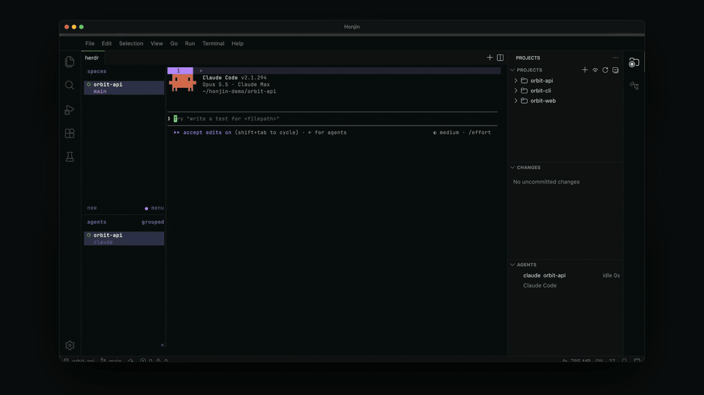

<p align="center"></p>

<h1 align="center">Honjin</h1>
<p align="center"><b>Run coding agents across all your projects from one window.</b><br>
Click + on any folder to start Claude Code, Codex, Antigravity CLI or opencode there.</p>
<p align="center">Public beta · 0.1.0-beta.1 · macOS on Apple silicon · free and open source (MIT)</p>

---




If you run several coding agents at once, you end up with a pile of terminal windows and no idea which agent is
waiting for you. Honjin is a code editor that keeps all your projects in one window and runs your agents in
[herdr](https://herdr.dev), a terminal that keeps them going in the background. One click starts an agent in any
folder, and a side panel shows which agents are working, which are blocked and which are done.

## What you get

- **Projects (right):** every project in the folders you choose, each a normal file tree. Hide the ones you aren't
  using.
- **+ on any folder:** starts an agent in that folder, in a herdr tab that belongs to the project. Honjin asks which
  agent you want and remembers your last choice. A project can have its own fixed command instead.
- **Agents:** every running agent, the ones that need you first. Click one to jump straight to it. A badge counts the
  agents that are blocked or done. **View: Toggle Agent Timeline** shows the last 15 minutes as one lane per agent.
- **Changes:** every uncommitted change across your projects, grouped by project. A pulsing dot marks files written
  in the last 30 seconds, so you can see where agents are working. Click a file for its diff.
- **herdr in the middle:** agents keep running when you close Honjin.
- **A full editor underneath:** built on [Eclipse Theia](https://theia-ide.org), with language support, git, a
  debugger and VS Code extensions from Open VSX. Theia's own AI chat is switched off: your agents live in herdr.

## Requirements

- A Mac with Apple silicon (M1 or later) running macOS 13 or later. Intel Macs, Windows and Linux are not built yet.
- [herdr](https://herdr.dev) and at least one coding agent (Claude Code, Codex, Antigravity CLI or opencode). You don't
  need to install them first: on first launch Honjin opens **Set Up Honjin**, shows what is missing and has an
  **Install** button for each. Re-open it any time from the command palette (**Honjin: Set Up Prerequisites**).
- git is optional. It only powers the Changes view and the branch in the status bar.

## Install

Paste this into Terminal:

```sh
curl -fsSL https://raw.githubusercontent.com/dhyeys54/honjin/main/scripts/install.sh | sh
```

It downloads the latest release, checks it against the published `SHA256SUMS`, and puts `Honjin.app` in
`/Applications`. Honjin opens without a macOS security prompt, because a file downloaded by `curl` is not
quarantined. The script is short; [read it](scripts/install.sh) before you run it if you like.

**To update**, run the same command again. It quits a running Honjin first and keeps your settings.

If `/Applications` isn't writable for your account, the script says so. Re-run it with `sudo sh` in place of `sh`, or
install for yourself only with `HONJIN_INSTALL_DIR=$HOME/Applications` (create the folder first).

### Install the zip by hand

1. Download `Honjin-<version>-arm64-mac.zip` and `SHA256SUMS` from the
   [latest release](https://github.com/dhyeys54/honjin/releases/latest).
2. In the folder you saved them to, run `shasum -a 256 -c SHA256SUMS --ignore-missing`. It should print `OK`.
3. Unzip it and drag `Honjin.app` into `/Applications`.
4. Honjin is not signed or notarised (the beta is free of the $99/year Apple fee), so macOS blocks the first launch.
   Open **System Settings → Privacy & Security**, scroll to the message about Honjin and click **Open Anyway**.
   Or remove the quarantine flag in Terminal: `xattr -dr com.apple.quarantine /Applications/Honjin.app`.

### Build from source

```sh
git clone https://github.com/dhyeys54/honjin && cd honjin
npm install
npm run package:mac        # electron-app/dist/mac-arm64/Honjin.app
```

Needs Node 20 or later, npm 10 or later and the Xcode Command Line Tools. See [CONTRIBUTING.md](CONTRIBUTING.md).

### Uninstall

Quit Honjin, delete `/Applications/Honjin.app` and `~/.honjin`. herdr keeps running in the background with your
agents; stop it with `herdr server stop`.

## First run

1. **Set Up Honjin** lists herdr and the agents, with a version for each one found. Click **Install** for anything
   missing: a terminal opens and runs the vendor's own installer, so you see exactly what happens. Then Honjin
   checks again.
2. Choose the folders that hold your projects (you can change them later with **Honjin: Choose Project
   Folders…**).
3. Click **+** next to any folder. The agent starts in a herdr tab there. The first time, the agent asks you to sign
   in; that's the agent's own login, not Honjin's.

## Settings

| Setting | Default | |
|---|---|---|
| `honjin.scanRoots` | `[]` | Folders whose subfolders are projects |
| `honjin.extraProjects` | `[]` | Projects added by hand |
| `honjin.hiddenProjects` | `[]` | Hidden projects |
| `honjin.agentCommands` | `{ "claude": "claude", "codex": "codex", … }` | The command + types for each agent in the picker; add flags here |
| `honjin.projectOverrides` | `{}` | Per-project `{ "startupCommand": "…" }` |
| `honjin.updates.check` | `true` | Ask GitHub once a day whether a newer Honjin exists (Honjin's only request of its own) |
| `honjin.herdr.path` / `honjin.herdr.session` | `"herdr"` / `""` | herdr binary, and session (empty = default) |

These are stored in `~/.honjin/settings.json`, never inside your repos.

## Privacy

- **No telemetry.** Honjin collects no usage data, crash reports or analytics.
- **One request of its own:** shortly after launch and then once a day, Honjin asks GitHub for the latest release
  (`api.github.com/repos/dhyeys54/honjin/releases/latest`) so it can tell you when a new build is out. It sends no
  cookies, account or project information; GitHub sees your IP address and the request itself, as it would for any
  download. Turn it off with `honjin.updates.check: false` in `~/.honjin/settings.json`.
- **Extensions** come from Open VSX (`open-vsx.org`), which the Extensions view contacts when you browse or search it.
- **Your code stays on your Mac.** Honjin reads your project folders to list them and show their files. It never
  uploads them.
- **Help → Report an Issue** opens your browser with a draft that holds only versions (Honjin, macOS, chip, herdr and
  agents). It contains no file paths or project names, and nothing is sent until you press Submit on GitHub.
- The agents you run (Claude Code, Codex and so on) and herdr have their own network behaviour and privacy policies.
  Honjin doesn't change them.
- Settings live in `~/.honjin/settings.json`, never inside your repositories.

## Known issues

The ones you're most likely to meet:

- Honjin isn't signed by Apple. The install command needs no extra step; the manual zip needs **Open Anyway** once.
- Closing Honjin leaves herdr and your agents running. That's on purpose. Stop them with `herdr server stop`.
- Search can come back empty right after startup. Run **Reload Window** and search again.

The full list, with workarounds: [docs/KNOWN-ISSUES.md](docs/KNOWN-ISSUES.md).

## Feedback

This is a beta and feedback is the point. **Help → Report an Issue** opens a GitHub issue with your versions already
filled in. There are also templates for [install problems and ideas](https://github.com/dhyeys54/honjin/issues/new/choose),
and [Discussions](https://github.com/dhyeys54/honjin/discussions) for anything else.

## Develop

This repo is set up to be built by coding agents with test-driven development:

| File | Purpose |
|---|---|
| [`AGENTS.md`](AGENTS.md) / [`CLAUDE.md`](CLAUDE.md) | Rules, commands and workflow for agents |
| [`docs/specs/`](docs/specs) | The behaviour contract, one spec per area |
| [`docs/PLAN.md`](docs/PLAN.md) | Ordered TDD tasks with tests and verify steps |
| [`docs/DECISIONS.md`](docs/DECISIONS.md) | Why things are the way they are |
| [`PRODUCT.md`](PRODUCT.md) / [`DESIGN.md`](DESIGN.md) | Product truth and design tokens (used by the `impeccable` skill) |
| `.claude/skills/` | `next-task`, `honjin-tdd`, `theia-dev`, `herdr-integration`, `honjin-polish` |

With Claude Code: open this folder, then run `/next-task` (one task) or `/loop /next-task` (keeps going until a
human checkpoint). Tests: `npm test` (unit), `npm run test:int` (real herdr, isolated session), `npm run test:e2e`
(Playwright).

See [CONTRIBUTING.md](CONTRIBUTING.md) before opening a pull request.

## License

MIT for Honjin's own code ([LICENSE](LICENSE)). Theia, Electron, Monaco and the bundled fonts keep their own licences;
see [THIRD_PARTY_NOTICES.md](THIRD_PARTY_NOTICES.md). The Honjin name and icon are not covered by the MIT licence:
forks are welcome under their own name, see [TRADEMARK.md](TRADEMARK.md).
