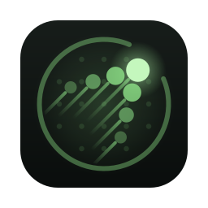
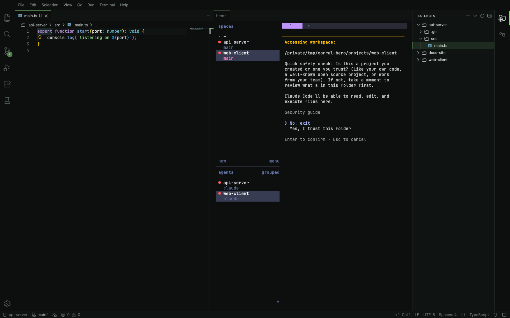

<p align="center"></p>

<h1 align="center">Corral</h1>
<p align="center">One window for all your projects. Agents run in <a href="https://herdr.dev">herdr</a>.</p>

---

Corral is a macOS IDE built on [Eclipse Theia](https://theia-ide.org). It keeps every active project in one window
and runs your coding agents (Claude Code) in herdr, not in a chat panel built into the IDE.

```
┌────────┬──────────────────────────┬──────────────────────────┬──────────────┐
│ search │ editor                   │ herdr                    │ PROJECTS     │
│ debug  │                          │  alpha ▸ 1 claude · 2 sh │ alpha      ▾ │
│ debug  │                          │                          │  src/    [+] │
│        │                          │                          │ beta       ▸ │
└────────┴──────────────────────────┴──────────────────────────┴──────────────┘
```

- **Projects panel (right):** every project under your chosen folders, each one a collapsible VS Code-style file
  tree. Hide the ones you're not using; the eye button brings them back.
- **+ on any folder:** opens a new herdr tab in that folder, inside that project's own herdr workspace, and runs
  your startup command (`claude` by default; can be set per project).
- **herdr in the middle:** agents keep running when Corral closes, and herdr shows which ones are working, blocked
  or done.
- **A full IDE underneath:** LSP, git, debugger and VS Code extensions (from Open VSX). Theia's built-in AI is
  included but switched off.

> **Status:** in development. The build follows [`docs/PLAN.md`](docs/PLAN.md); features land stage by stage.

## Requirements

- macOS on Apple Silicon, Node ≥ 20 (developed on 24), npm ≥ 10, Xcode Command Line Tools (for native modules).
- [herdr](https://herdr.dev/docs/install/) ≥ 0.9 on your `PATH` (or set `corral.herdr.path`).
- [Claude Code](https://code.claude.com) CLI, or change the startup command to your own agent.
- For icons only: `brew install librsvg imagemagick`.

## Run

```bash
npm install
npm run download:plugins          # built-in VS Code extensions (git, TS, JSON, …)
npm run build:electron && npm run start:electron
```

On first launch Corral asks which folders hold your projects. You can pick several, and change them later with
**Corral: Choose Project Folders…**.

Build the app bundle: `npm run package:mac` → `electron-app/dist/mac-arm64/Corral.app`. It isn't code-signed, so
the first time you open it, right-click → Open, or run `xattr -dr com.apple.quarantine Corral.app`.

## Settings

| Setting | Default | |
|---|---|---|
| `corral.scanRoots` | `[]` | Folders whose subfolders are projects |
| `corral.extraProjects` | `[]` | Projects added by hand |
| `corral.hiddenProjects` | `[]` | Hidden projects |
| `corral.startupCommand` | `"claude"` | Typed into each new herdr tab (`""` = plain shell) |
| `corral.projectOverrides` | `{}` | Per-project `{ "startupCommand": "…" }` |
| `corral.herdr.path` / `corral.herdr.session` | `"herdr"` / `""` | herdr binary, and session (empty = default) |

These are stored in `~/.corral/settings.json`, never inside your repos.

## Develop

This repo is set up to be built by coding agents with test-driven development:

| File | Purpose |
|---|---|
| [`AGENTS.md`](AGENTS.md) / [`CLAUDE.md`](CLAUDE.md) | Rules, commands and workflow for agents |
| [`docs/specs/`](docs/specs) | The behaviour contract, one spec per area |
| [`docs/PLAN.md`](docs/PLAN.md) | Ordered TDD tasks with tests and verify steps |
| [`docs/DECISIONS.md`](docs/DECISIONS.md) | Why things are the way they are |
| [`PRODUCT.md`](PRODUCT.md) / [`DESIGN.md`](DESIGN.md) | Product truth and design tokens (used by the `impeccable` skill) |
| `.claude/skills/` | `next-task`, `corral-tdd`, `theia-dev`, `herdr-integration`, `corral-polish` |

With Claude Code: open this folder, then run `/next-task` (one task) or `/loop /next-task` (keeps going until a
human checkpoint). Tests: `npm test` (unit), `npm run test:int` (real herdr, isolated session), `npm run test:e2e`
(Playwright).

## Screenshots



Editor, herdr terminal and Projects tree in one window: three projects, two of them with their own herdr tab
running `claude`. The screenshot is the real app, unedited. The `claude` trust prompt is Claude Code's own
first-run question for a new folder.

Before/after shots of the chrome polish pass are in [`docs/screenshots/`](docs/screenshots/).

## License

MIT for Corral's own code. Theia is EPL-2.0 / GPL-2.0-with-classpath-exception; JetBrains Mono is OFL-1.1.
